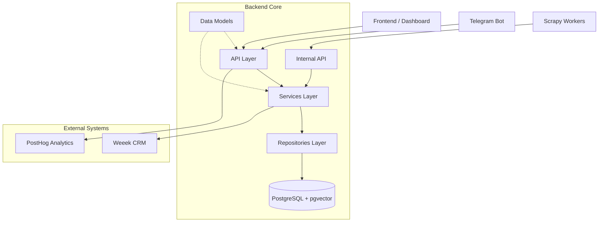

# API Reference Overview 🚀

Welcome to the Gifty Technical API Reference. Our system is built using a layered architecture, where each component has a clear area of responsibility.

## Interaction Architecture

---

## Documentation Sections

### 📦 [Data Models](models.md)
Description of Pydantic schemas and SQLAlchemy models. This section defines the data structures transferred between frontend and backend, as well as how they are stored in the database.

### ⚙️ [Services](services.md)
The system's business logic. Services coordinate the work of repositories and external integrations to solve high-level tasks (e.g., product ingestion flow or recommendation logic).

### 🗄 [Repositories](repositories.md)
The data access layer. Direct interaction with the database via SQLAlchemy. Repositories encapsulate complex SQL queries and vector searches.

### 📊 [Analytics API](analytics.md)
A secure proxy layer for retrieving product metrics from PostHog and technical data from Prometheus/Loki.

### 🔐 [Internal API](internal.md)
Interfaces for internal needs: worker management, manual parser execution, product batch ingestion, and AI scoring tasks.

### 🔌 [Integrations (Weeek)](../weeek_api_reference.md)
Reference for Weeek API integration used for task management and team access control.

---

!!! info "Auto-generation"
    Most of this section is automatically generated from Python docstrings using `mkdocstrings`.
