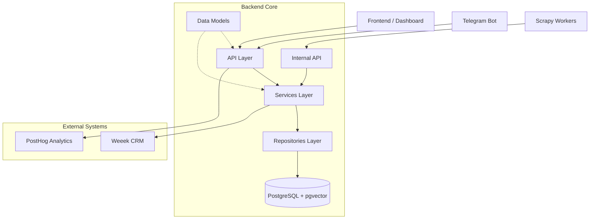

# API Reference Overview 🚀

Добро пожаловать в технический справочник API Gifty. Наша система построена по слоистой архитектуре, где каждый компонент имеет четкую зону ответственности.

## Архитектура взаимодействия

---

## Разделы документации

### 📦 [Data Models](models.md)
Описание Pydantic-схем и SQLAlchemy моделй. Здесь определены структуры данных, которые передаются между фронтендом и бэкендом, а также способ их хранения в базе.

### ⚙️ [Services](services.md)
Бизнес-логика системы. Сервисы координируют работу репозиториев, внешних интеграций и решают высокоуровневые задачи (например, процесс инжеста товаров или логика рекомендаций).

### 🗄 [Repositories](repositories.md)
Слой работы с данными. Прямое взаимодействие с базой данных через SQLAlchemy. Репозитории инкапсулируют сложные SQL-запросы и векторный поиск.

### 📊 [Analytics API](analytics.md)
Защищенный прокси-слой для получения продуктовых метрик из PostHog и технических данных из Prometheus/Loki.

### 🔐 [Internal API](internal.md)
Интерфейсы для внутренних нужд: управление воркерами, принудительный запуск парсеров, прием партий товаров и задачи для AI-скоринга.

### 🔌 [Integrations (Weeek)](../weeek_api_reference.md)
Справочник по интеграции с Weeek API для управления задачами и доступом команды.

---

!!! info "Автогенерация"
    Большая часть этого раздела генерируется автоматически на основе docstrings в коде Python с помощью `mkdocstrings`.
