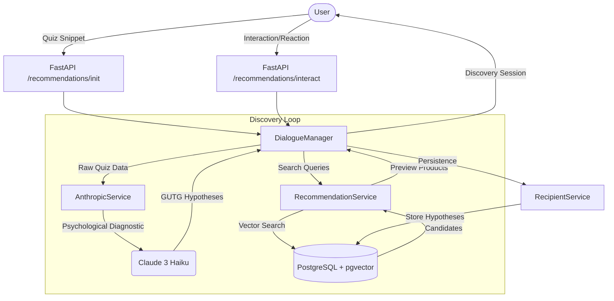

# Discovery & Recommendation Engine (v2)

This document provides a technical overview of the "Dialogue-driven Discovery" system, which powers the Gifty recommendation engine.

## 1. High-Level Architecture

The system transitions from a static "quiz-to-list" model to an interactive "discovery dialogue."

## 2. Core Components

### `DialogueManager` (The Orchestrator)
The central brain of the discovery flow. It manages:

- **Session Lifecycle**: `init_session` creates the state and triggers initial analysis.
- **State Management**: Orchestrates transitions between `QUIZ`, `OVERVIEW`, `DEEP_DIVE`, and `COMPILATION`.
- **Parallelism**: Runs multiple "Topic Tracks" in parallel to provide diverse gift directions.

### `AnthropicService` (The Intelligence)
The bridge between our business logic and LLM capabilities.

- **AI-Native Diagnostic**: Instead of hardcoded rules, it passes raw Quiz Data to Claude.
- **Hypothesis Generation**: Uses the **Grand Unified Theory of Gifting (GUTG)** to craft specific psychological "Gaps" (Mirror, Anchor, Optimizer, etc.).
- **Search Query Synthesis**: Generates 3-5 specific keywords for the vector search engine.

### `RecommendationService` (The Retriever)
Interacts with the product catalog using semantic search.

- **Vector Retrieval**: Uses `pgvector` to find products matching the AI-generated queries.
- **Reranking**: (In Deep Dive) Uses cross-encoders to ensure the closest possible match to the hypothesis description.
- **Lazy Loading**: Supports fetching products on-demand when a user expands a specific hypothesis.

### `RecipientService` (The Persistence)
Handles long-term storage and analytical data.

- **Profile Management**: Stores recipient data (age, gender, relationships).
- **Hypothesis Analytics**: Saves every generated hypothesis and user reactions (likes/dislikes) for future model fine-tuning.

## 3. The Discovery Loop Flow

1. **Initialization**: User submits a quiz. `DialogueManager` creates a `RecipientProfile` and `RecommendationSession`.
2. **Analysis**: `AnthropicService` analyzes raw data and picks 3 main interest topics.
3. **Drafting (Bulk)**: Claude generates 2-3 hypotheses for each topic in a single bulk call.
4. **Retrieval**: `RecommendationService` fetches 3 preview products for each hypothesis.
5. **Presentation**: User sees "Topic Tracks" with catchy titles and ideas.
6. **Deep Dive**: When a user "likes" an idea, the system fetches 15+ highly relevant products for that specific hypothesis.

## 4. Why This Matters

- **Psychological Depth**: We don't just match keywords; we fulfill needs (e.g., "Permission to indulge").
- **Low Latency**: Bulk LLM calls and parallel retrieval keep the experience snappy.
- **Scalability**: New GIFTING Gaps or logic changes are implemented via prompt engineering, not complex code refactors.
- **Learning**: Database persistence of user reactions allows us to build a dataset for training custom rankers.
