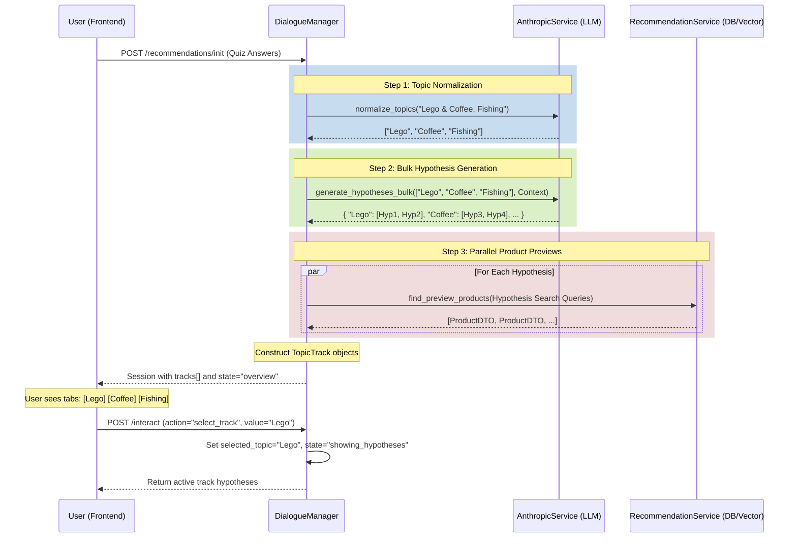

# Multi-Track Discovery Architecture

This document details the architecture of the **Multi-Track Discovery System**, introduced to allow parallel exploration of multiple user interests simultaneously, replacing the previous sequential topic processing.

## Core Concept
Instead of processing one topic at a time (e.g., "Lego" -> Hypotheses -> Next Topic), the system now parallelizes the discovery process:

1.  **Normalizes** the user's input (e.g., "Lego and coffee") into distinct topics (["Lego", "Coffee"]).
2.  **Generates** hypotheses for *all* normalized topics in a single **bulk** LLM call.
3.  **Fetches** product previews for all generated hypotheses in parallel.
4.  **Presents** all tracks to the user simultaneously (e.g., as tabs or cards).

## System Flow



## detailed Components

### 1. Topic Normalizer (`AnthropicService.normalize_topics`)
Crucial for handling mixed inputs like "Lego and coffee".

*   **Input**: `["Lego and coffee", "Travel"]`
*   **LLM Task**: Split compound topics, remove noise, translate to session language.
*   **Output**: `["Lego", "Coffee", "Travel"]`

### 2. Bulk Generator (`AnthropicService.generate_hypotheses_bulk`)
Optimized for performance and Rate Limits. Instead of $N$ calls for $N$ topics, we make **1 call** with a JSON prompt asking for hypotheses for all topics at once.
This reduces latency from ~2-3 minutes (sequential) to ~10-15 seconds.

### 3. Track Structure (`recommendations.models.TopicTrack`)
The session now holds a list of tracks, not just a single active topic.

```python
class TopicTrack(BaseModel):
    topic_id: str
    topic_name: str         # e.g. "Lego"
    title: str              # User-facing title
    preview_text: str       # Short description
    hypotheses: List[Hypothesis]
```

### 4. State Machine Updates
*   **New State**: `DiscoveryState.OVERVIEW` — The initial state after `init`, where multiple tracks are available but none is "active" yet.
*   **New Action**: `select_track` — Transitions from `OVERVIEW` to `SHOWING_HYPOTHESES` for a specific topic.

## Performance Considerations
*   **Latency**: The bulk generation step dominates latency (~10s).
*   **Rate Limits**: By using a single bulk call, we stay well within Anthropic Tier 1 limits (unlike parallel requests which trigger 429 errors).
*   **Fallback**: If bulk generation fails, the system falls back to processing just the first topic sequentially.
