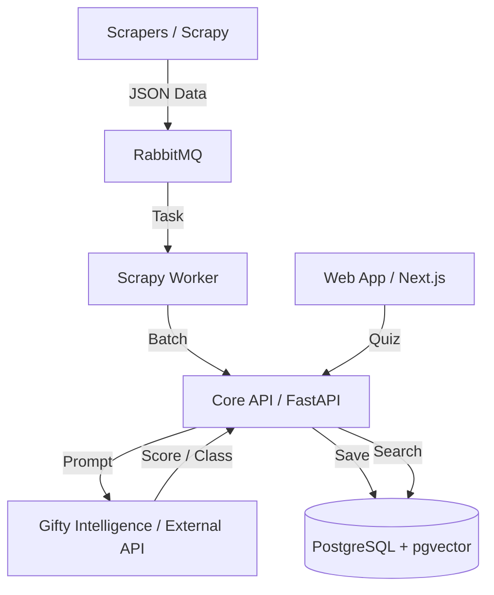

# Architecture Overview

The Gifty system consists of several key components interacting with each other:

### Main Layers

1.  **Data Parsing**: Collecting product information from donor sites.
2.  **Processing & Enrichment**: Using LLM to score giftability and automatically map categories.
3.  **Vectorization**: Transforming product descriptions into vectors for semantic search.
4.  **Recommendation Engine**: Finding the most suitable vectors based on the user's questionnaire.
5.  **Interface**: Web application for user interaction.
