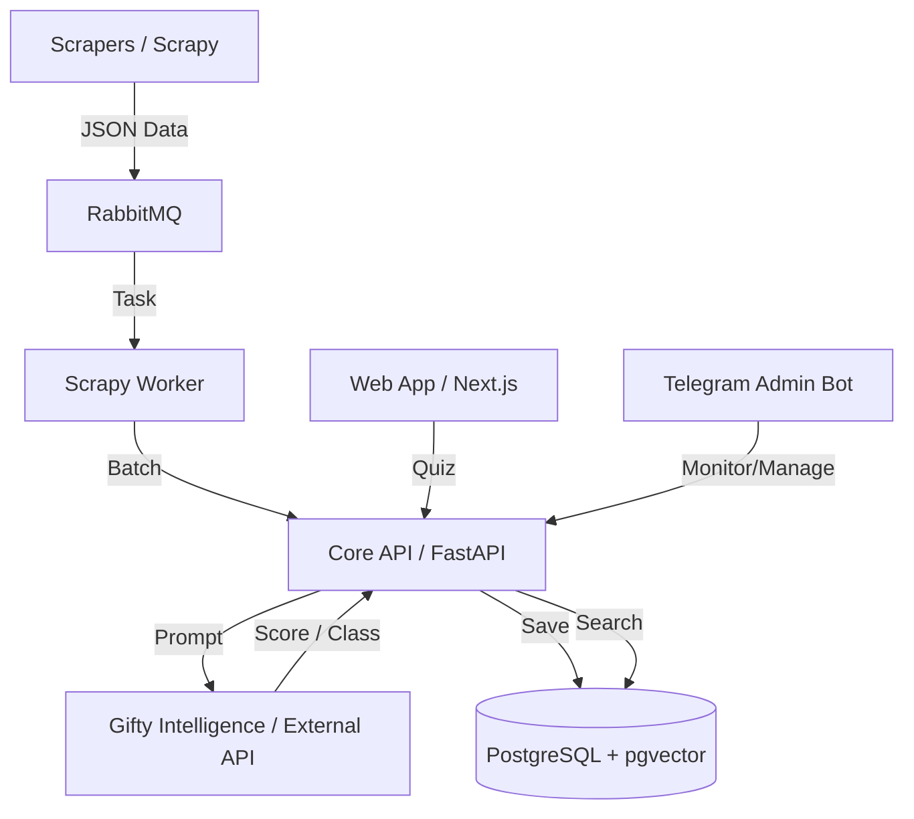

# Обзор архитектуры

Система Gifty состоит из нескольких ключевых компонентов, взаимодействующих друг с другом:

### Основные слои

1.  **Парсинг данных**: Сбор информации о товарах с сайтов-доноров.
2.  **Обработка и обогащение**: Использование LLM для оценки "подарочности" товара и автоматической привязки к категориям.
3.  **Векторизация**: Превращение описаний товаров в векторы для семантического поиска.
4.  **Рекомендательный движок**: Подбор наиболее подходящих векторов на основе анкеты пользователя.
5.  **Интерфейсы**: 
    - **Web App**: Потребительский интерфейс для подбора подарков.
    - **Telegram Admin Bot**: Инструмент для внутреннего управления, мониторинга и связи с командой.

### Инфраструктура и CI/CD

Проект развернут на базе Docker Compose и использует современные практики автоматизации:

*   **GitHub Actions**: Полный цикл CI (Continuous Integration) при каждом пуше. Сначала прогоняются тесты, затем происходит деплой.
*   **Blue-Green Deployment**: Стратегия развертывания без прерывания обслуживания. Система переключается между двумя контейнерами на разных портах только после успешного прохождения проверки здоровья (Health Check).
*   **Nginx Proxy**: Внешний прокси на хосте, который обеспечивает SSL и бесшовное переключение версий через обновление порта в upstream.
