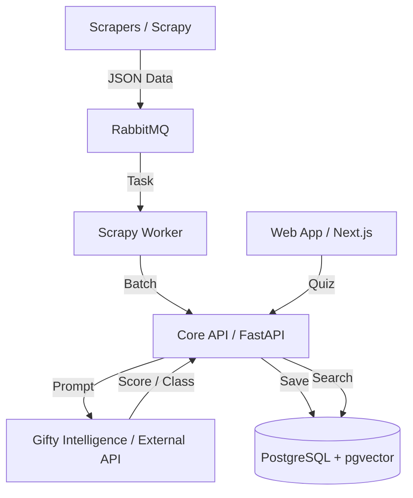

# Обзор архитектуры

Система Gifty состоит из нескольких ключевых компонентов, взаимодействующих друг с другом:

### Основные слои

1.  **Парсинг данных**: Сбор информации о товарах с сайтов-доноров.
2.  **Обработка и обогащение**: Использование LLM для оценки "подарочности" товара и автоматической привязки к категориям.
3.  **Векторизация**: Превращение описаний товаров в векторы для семантического поиска.
4.  **Рекомендательный движок**: Подбор наиболее подходящих векторов на основе анкеты пользователя.
5.  **Интерфейс**: Веб-приложение для взаимодействия с пользователем.
