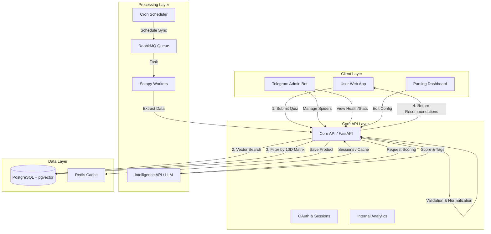

# Обзор архитектуры

Система Gifty состоит из нескольких ключевых компонентов, взаимодействующих друг с другом:

### Основные слои

1.  **Парсинг данных**: Сбор информации о товарах с сайтов-доноров.
    *   👉 **[Архитектура парсинга](parsing.md)**
    *   👉 **[Как добавить новый парсер](../guides/parsing.md)**
2.  **Обработка и обогащение**: Использование LLM для оценки "подарочности" товара и автоматической привязки к категориям.
    *   👉 **[Gifty Intelligence API](intelligence.md)**
3.  **Векторизация и Рекомендации**: Превращение описаний в векторы и подбор на основе анкеты.
    *   👉 **[Теория GUTG](grand_unified_theory.md)**
    *   👉 **[Алгоритмы рекомендаций](recommendations.md)**
4.  **Интерфейсы**: 
    *   **Web App**: Фронтенд для подбора подарков.
    *   **Telegram Admin Bot**: Управление и мониторинг. 
        *   👉 **[Гайд пользователя](../guides/telegram_bot.md)**
        *   👉 **[Внутреннее устройство (Internals) (New!)](telegram_bot_internals.md)**

### Аналитика и Мониторинг 📊

В системе внедрена сквозная аналитика для бизнес-метрик и технического мониторинга:

- **PostHog**: Продуктовая аналитика (события, воронки, когорты).
- **Prometheus & Grafana**: Техническое состояние серверов, время ответа API, RAM/CPU.
- **Loki**: Централизованный сбор логов со всех микросервисов.

👉 **[Гайд по Analytics API](../guides/analytics_api_quickstart.md)**

### Инфраструктура и CI/CD

Проект развернут на базе Docker Compose и использует современные практики автоматизации:

*   **GitHub Actions**: Полный цикл CI (Continuous Integration) при каждом пуше. Сначала прогоняются тесты, затем происходит деплой.
*   **Blue-Green Deployment**: Стратегия развертывания без прерывания обслуживания. Система переключается между двумя контейнерами на разных портах только после успешного прохождения проверки здоровья (Health Check).
*   **Nginx Proxy**: Внешний прокси на хосте, который обеспечивает SSL и бесшовное переключение версий через обновление порта в upstream.
