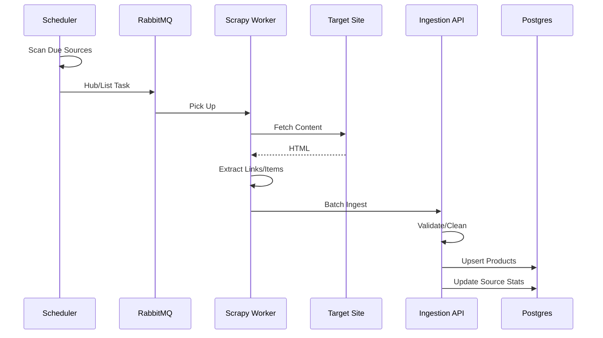

# Professional Parsing Architecture v2.1

This document describes the target architecture of the data collection system (Scraping System) for the Gifty project. We are moving from a monolithic scraper execution to a distributed microservice architecture.

---

## 1. General Architecture (The Big Picture)

The system is divided into three logical layers:
1.  **Orchestration (Brain)**: Plans *what* and *when* to parse.
2.  **Execution (Muscles)**: Isolated Scrapy workers.
3.  **Storage & Processing (Memory)**: Data ingestion, validation, and storage.

Communication: **RabbitMQ**.

---

## 2. Orchestration Layer (Scheduler)

### 2.1 Source Classification (Source Types)
The system distinguishes between different page types as they require different processing strategies. A `type` field is introduced in the database:

1.  **Hub / Category List (`hub`)**:
    *   *Example*: `site.com/catalog/gifts` (grid of categories like "For Mom", "For Dad").
    *   *Task*: **Discovery**. Find links to new subcategories and add them to the DB. Does not parse products.
    *   *Frequency*: Rare (weekly/monthly). Site structure changes infrequently.

2.  **Product List (`list`)** — **Primary type**:
    *   *Example*: `mrgeek.ru/category/all-products/`.
    *   *Task*: **Extraction**. Iterate through pagination, collect brief data (Price, Title, Image) and product card links.
    *   *Frequency*: Daily (every 12-24h).

3.  **Single Product (`product`)**:
    *   *Task*: **Deep Dive**. Get full description, specs, reviews.

4.  **Sitemap XML (`sitemap`)**:
    *   *Task*: **Bulk Discovery**. Allows getting 100% of store links without HTML parsing.

### 2.2 Processing Strategies
The `strategy` field refines the worker behavior:
*   **`deep` (Primary)**: Full synchronization. Go through all pages. Update all found products.
*   **`discovery` (Search)**: Used for `type: hub`. Find new links, do not collect products.

### 2.3 `ParsingSource` Data Model
A registry table in PostgreSQL:

| Field | Type | Description |
|---|---|---|
| `url` | String | Entry point. |
| `type` | Enum | `hub`, `list`, `product`, `sitemap`. |
| `site_key` | String | e.g. `mrgeek`. Defines the Spider class. |
| `priority` | Int | 1-100. Affects ordering in RabbitMQ. |
| `refresh_interval` | Int | Base frequency (hours). |
| `next_sync_at` | DateTime | Next run time (indexed). |
 
### Implementation Status

---

## 3. Execution Layer (Scraping Workers)

Microservice based on **Scrapy**. Processes tasks from the queue.

### Worker Workflow
1.  **Consume**: Receives a JSON task.
2.  **Select Spider**: Runs the appropriate spider class.
3.  **Crawl**: Proxy rotation, User-Agent rotation, Throttling.
4.  **Output**: Sends batches to the API.
 
### Implementation Status

---

## 4. Ingestion Layer (Ingestion API)

Parsers do not write to the DB directly. The API (`POST /internal/ingest`) acts as a gatekeeper:
1.  **Validation**: Filters out broken items.
2.  **Normalization**: Currency conversion, HTML cleaning.
3.  **Upsert**: Updates or creates products.
4.  **Feedback**: Records stats for the Scheduler.
 
### Implementation Status

---

## 5. Implementation Roadmap

1.  **MVP**: Set up RabbitMQ + Scrapy project + 1 spider (`list`).
2.  **DB**: Create `ParsingSource` table.
3.  **Discovery**: Implement `hub` spiders for auto-filling the link database.
4.  **Scale**: Connect paid proxies and Playwright for JS-heavy sites.

---

## 6. Testing and Deployment (CI/CD)

Scraper development requires a specific approach to testing, as websites change constantly.

### 6.1 Local Testing (Fixture Tests)
We do not test on live sites in CI (it's unreliable).
1.  The developer saves the HTML page to a file: `tests/fixtures/mrgeek.html`.
2.  Writes a test that runs the Spider against this file.
3.  Verifies that exactly 36 items are extracted and fields (Price, Title) are not empty.

### 6.2 Update Process
Scraper Service is a stateless container.
1.  On code update, a new Docker image is built.
2.  Workers are restarted gradually (Rolling Update).
3.  Tasks in RabbitMQ are not lost: if a worker dies during processing, the task returns to the queue.

### Implementation Status

