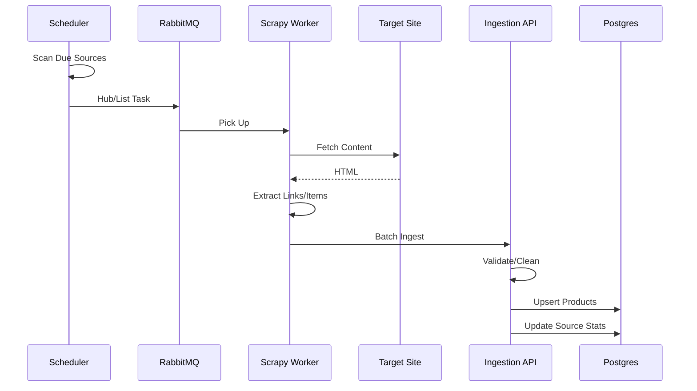

# Профессиональная Архитектура Парсинга v2.1

В этом документе детально описана целевая архитектура системы сбора данных (Scraping System) для проекта Gifty. Мы переходим от монолитного запуска парсеров к распределенной микросервисной архитектуре.

---

## 1. Общая Архитектура (The Big Picture)

Система разделена на три логических слоя:

1.  **Orchestration (Мозг)**: Планирует, *что* и *когда* парсить, исходя из типа страницы и приоритетов.
2.  **Execution (Мышцы)**: Изолированные воркеры на базе Scrapy.
3.  **Storage & Processing (Память)**: Приемка, валидация и сохранение данных.



---

## 2. Слой Оркестрации (Scheduler)

### 2.1 Классификация Источников (Source Types)
Система различает типы страниц, так как они требуют разных стратегий обработки. В БД вводится поле `type`:

1.  **Hub / Category List (`hub`)**:
    *   *Пример*: `groupprice.ru/catalog/gifts` (плитка категорий "Маме", "Папе").
    *   *Задача*: **Discovery**. Найти ссылки на новые подкатегории и добавить их в БД. Не парсит товары.
    *   *Частота*: Редко (раз в неделю/месяц). Структура сайтов меняется нечасто.

2.  **Product List (`list`)** — **Основной тип**:
    *   *Пример*: `mrgeek.ru/category/vse-tovary/`.
    *   *Задача*: **Extraction**. Пройтись по пагинации, собрать краткие данные (Цена, Название, Картинка) и ссылки на карточки.
    *   *Частота*: Ежедневно (раз в 12-24ч).
    *   *Стратегия*: Мы храним в БД именно "листовые" категории (конечные). Это надежнее, чем каждый раз сканировать Хаб.

3.  **Single Product (`product`)**:
    *   *Пример*: `ozon.ru/product/iphone-15`.
    *   *Задача*: **Deep Dive**. Получить полное описание, характеристики, отзывы.
    *   *Использование*: Используется точечно, когда данных из списка недостаточно или нужно мониторить цену VIP-товара каждый час.

4.  **Sitemap XML (`sitemap`)**:
    *   *Пример*: `site.com/sitemap.xml`.
    *   *Задача*: **Bulk Discovery**. "Золотой Грааль" — позволяет получить 100% ссылок магазина без парсинга HTML.
    *   *Сложность*: Низкая, эффективность максимальная.

### 2.2 Стратегии обработки (Strategies)
Поле `strategy` уточняет поведение воркера в рамках выбранного типа страницы:

*   **`deep` (Основная)**: Полная синхронизация. Идем по всем страницам. Обновляем все найденные товары.
*   **`discovery` (Поиск)**: Используется только для `type: hub`. Ищем новые ссылки, товары не собираем.

### 2.3 Модель данных `ParsingSource`
Таблица-реестр в PostgreSQL:

| Поле | Тип | Описание |
|---|---|---|
| `url` | String | Точка входа. |
| `type` | Enum | `hub`, `list`, `product`, `sitemap`. |
| `site_key` | String | `mrgeek`, `ozon`. Определяет класс Spider'а. |
| `priority` | Int | 1-100. Влияет на очередность в RabbitMQ. |
| `refresh_interval` | Int | Базовая частота (часы). |
| `next_sync_at` | DateTime | Время следующего запуска (индекс). |
| `config` | JSON | Специфичные настройки (Cookie, Geo, Proxy settings). |

### 2.4 Логика Планировщика (The Loop)
Запускается по Cron (раз в 5 минут):

1.  **Select**: Выбирает активные источники, где `next_sync_at <= NOW()`.
2.  **Lock**: Обновляет `next_sync_at` на будущее ("бронирует").
3.  **Publish**: Отправляет задачу в RabbitMQ с указанием `page_type`.
    *   Если воркер увидит `type='hub'`, он запустит логику поиска ссылок.
    *   Если `type='list'`, запустит логику сбора товаров.

### 2.5 Smart Scheduling (Умное планирование)
Вместо фиксированных интервалов система использует адаптивную логику, основанную на обратной связи от Ingestion API:

1.  **Адаптивный интервал (Stale Decay)**:
    *   Если запуск не выявил изменений (`items_updated == 0`), интервал между проверками постепенно увеличивается (Step: x1.5).
    *   Если обнаружена высокая активность (много новинок или смен цен), интервал сокращается до минимума для этого источника.
2.  **Exponential Backoff (Обработка блокировок)**:
    *   При получении ошибок сети или блокировок (403, 503), время следующего запуска отодвигается по экспоненте: 1ч -> 4ч -> 24ч.
3.  **Приоритезация**:
    *   Задачи в RabbitMQ отправляются с разным `priority` (используя RabbitMQ Priority Queues). Популярные категории и сайты с высоким `Base_Priority` обрабатываются воркерами в первую очередь.
4.  **Окно обслуживания**:
    *   Возможность ограничить парсинг конкретных сайтов только ночным временем, чтобы снизить риск обнаружения и нагрузку на сайт-донор.

### Статус реализации
<div class="weeek-tracker" data-tag-names="Parsing"></div>

---

## 3. Слой Исполнения (Scraping Workers)

Микросервис на базе **Scrapy**. Обрабатывает задачи из очереди.

### Workflow Воркера
1.  **Consume**: Получает JSON задачу.
    ```json
    { "url": "...", "type": "list", "site_key": "mrgeek" }
    ```
2.  **Select Spider**: Запускает нужный Java/Python класс.
3.  **Crawl**:
    *   **Proxy Rotation**: Middleware меняет IP при бане (403/Captсha).
    *   **User-Agent**: Ротация заголовков.
    *   **Throttling**: Авто-снижение скорости, если сайт тормозит.
4.  **Output**:
    *   Если `list`: Отправляет пачку товаров (Batch) в API.
    *   Если `hub`: Отправляет найденные URL категорий в API для создания новых `ParsingSource`.

### Статус реализации
<div class="weeek-tracker" data-tag-names="Parsing" data-project-id="2"></div>

---

## 4. Слой Данных (Ingestion API)

Парсеры не пишут в БД напрямую. API (`POST /internal/ingest`) выполняет роль стража:

1.  **Validation**: Отсеивает битые товары (нет цены/картинки).
2.  **Normalization**: Валюты -> RUB, очистка HTML тегов.
3.  **Upsert**: Обновляет существующий товар или создает новый.
4.  **Feedback**: Записывает статистику (items_found, duration), чтобы Планировщик мог адаптировать частоту.

### 4.1 AI Category Mapping (Маппинг категорий)
Чтобы привести тысячи внешних категорий ("Прикольные кружки", "Чашки для чая") к единому виду Gifty:

1.  **Table `CategoryMap`**: Хранит связку `external_name` -> `internal_category_id`.
2.  **Runtime**: Если Ingestion API встречает новое название категории, он сохраняет его в `CategoryMap` с `internal_id=NULL` и помечает товар временной меткой.
3.  **Background Job (AI Classifier)**: Раз в час берет неразмеченные категории и отправляет LLM (Gemini/GPT) вместе со списком наших внутренних категорий.
    *   *Prompt*: "Сопоставь список А со списком Б".
    *   Результат сохраняется в БД, и товары автоматически обновляются.
 
### Статус реализации
<div class="weeek-tracker" data-tag-names="Ingestion,AI" data-project-id="2"></div>

---

## 5. Roadmap внедрения

1.  **MVP**: Поднять RabbitMQ + Scrapy проект + 1 паук (`list`).
2.  **DB**: Создать таблицу `ParsingSource` с типами.
3.  **Discovery**: Реализовать логику `hub` пауков для авто-наполнения базы ссылками.
4.  **Scale**: Подключить платные прокси и Playwright (для JS-сайтов).

---

## 6. Тестирование и Деплой (CI/CD)

Разработка парсеров требует специфического подхода к тестам, так как сайты постоянно меняются.

### 6.1 Локальное тестирование (Fixture Tests)
Мы не тестируем на живых сайтах в CI (это ненадежно).
1.  Разработчик сохраняет HTML-страницу в файл: `tests/fixtures/mrgeek.html`.
2.  Пишет тест, который натравливает Spider на этот файл.
3.  Проверяет, что извлеклось ровно 36 товаров и поля (Цена, Название) не пустые.
*   **Плюс**: Тесты пролетают за секунду и работают без интернета.

### 6.2 Процесс обновления
Scraper Service — это Stateless контейнер.
1.  При обновлении кода собирается новый Docker image.
2.  Воркеры перезапускаются поэтапно (Rolling Update).
3.  Задачи в RabbitMQ не теряются: если воркер умер во время обработки, задача просто возвращается в очередь для другого воркера.
---

## 7. Быстрый старт для разработчика парсеров

### 7.1 Создание нового паука
1. Создайте файл `services/gifty_scraper/spiders/mysite.py`.
2. Наследуйтесь от `GiftyBaseSpider`.
3. Реализуйте метод `parse_catalog`.

```python
from gifty_scraper.base_spider import GiftyBaseSpider

class MySiteSpider(GiftyBaseSpider):
    name = "mysite"
    site_key = "mysite"
    
    def parse_catalog(self, response):
        for item in response.css('.product'):
            yield self.create_product(
                title=item.css('h1::text').get(),
                price=item.css('.price::text').get(),
                product_url=response.urljoin(item.css('a::attr(href)').get())
            )
```

### 7.2 Локальное тестирование
Вы можете запустить паука без поднятия Docker и RabbitMQ:
```bash
python scripts/test_spider.py mysite "https://mysite.com/catalog" --limit 5
```
Результаты будут сохранены в `test_results.json`.

### 7.3 Добавление в систему
1. Зарегистрируйте паука в `services/run_worker.py` в словаре `SPIDERS`.
2. Добавьте запись в таблицу `parsing_sources` (через админку или SQL).
3. Планировщик сам подхватит новый источник и отправит задачу воркеру.
