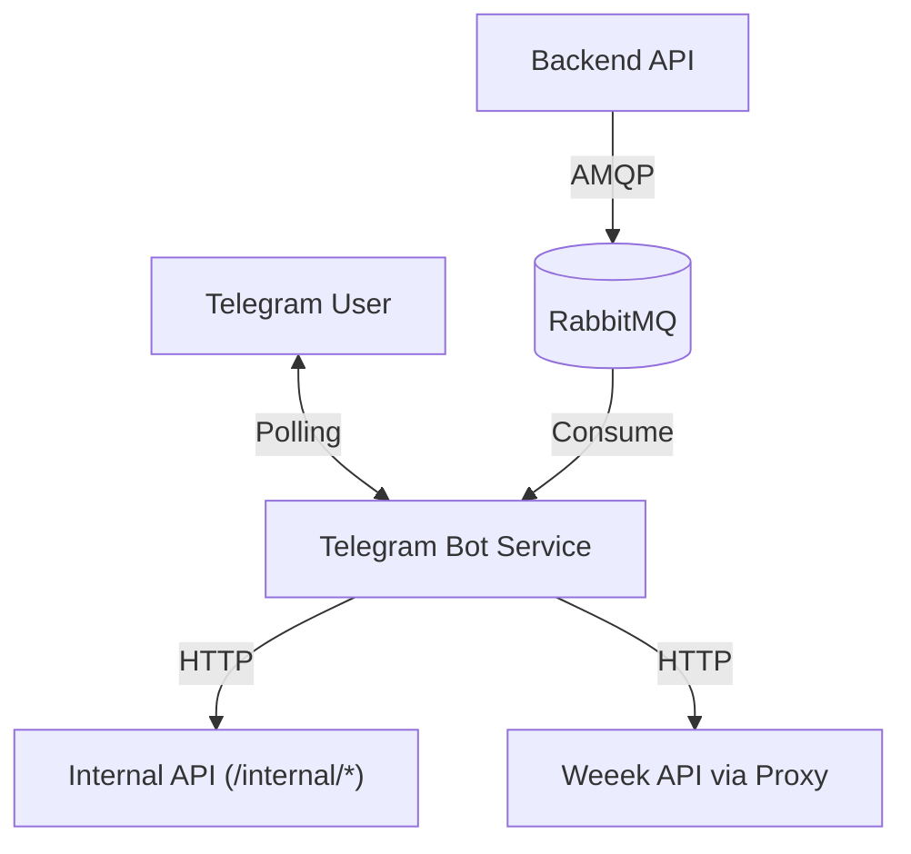

# Telegram Bot Internals 🤖

Раздел описывает внутреннее устройство Telegram-бота Gifty. Документация предназначена для разработчиков, поддерживающих бота и расширяющих его функционал.

---

## 🏗 Архитектура

Бот реализован на фреймворке **Aiogram 3.x** и работает как отдельный микросервис в контейнере `gifty-bot`. Он выполняет две основные функции:

1.  **Admin Interface**: Управление системой через команды и меню (Polling).
2.  **Notification Center**: Получение и рассылка уведомлений из системы (RabbitMQ Consumer).

### Схема взаимодействия



---

## 📂 Структура проекта

Код бота находится в директории `services/telegram_bot/`:

*   `app/main.py`: Точка входа. Содержит инициализацию `Bot`, `Dispatcher`, все хендлеры (команд и callback) и FSM.
*   `app/client.py`: `TelegramInternalClient` — обертка над `httpx` для общения с основным бекендом (Internal API).
*   `app/strings.py`: Файл локализации (RU/EN). Все тексты хранятся здесь.
*   `app/dashboard/`: Исходный код Mini App (React) для веб-интерфейса.

---

## 🧩 Ключевые системы

### 1. Система уведомлений (Notification System)

Бот слушает очередь `notifications` в RabbitMQ.

**Формат сообщения (JSON):**
```json
{
  "topic": "investors",
  "text": "New investor lead: John Doe",
  "data": { "id": 123 },
  "timestamp": "2024-02-10T12:00:00"
}
```

**Логика обработки:**

1.  При получении сообщения бот проверяет его `topic`.
2.  Запрашивает из БД (через Internal API) список подписчиков на этот топик.
3.  Рассылает сообщение каждому подписчику.

**Топики (`TOPICS`):**

*   `investors`, `partners`, `newsletter` — бизнесовые лиды.
*   `system`, `scraping` — технические алерты.

### 2. Управление доступом (RBAC)

Бот имеет собственную систему прав, основанную на флагах. Данные хранятся в модели `TelegramSubscriber` в основной БД.

**Роли:**

*   `guest`: Нет доступа.
*   `admin`: Базовый доступ.
*   `superadmin`: Полный доступ, управление другими пользователями.

**Permissions:**

*   `stats:view`: Просмотр аналитики.
*   `system:health`: Проверка здоровья системы.
*   `parsing:manage`: Управление парсерами.
*   `notifications:manage`: Настройка своих подписок.
*   `tasks:manage`: Работа с задачами Weeek.

### 3. Интеграция с Weeek

Реализована через FSM `ConnectWeeek`.

1.  Пользователь вводит API-токен Weeek.
2.  Бот валидирует его через эндпоинт `/internal/weeek/connect`.
3.  При успехе создается связь `WeeekAccount` -> `TelegramSubscriber`.

---

## ⚙️ State Machines (FSM)

Бота использует `aiogram.fsm` для ведения диалогов.

| Класс FSM | Назначение | Этапы |
| :--- | :--- | :--- |
| `AddUser` | Добавление нового админа | `username` -> `password` -> `name` -> `mentor` -> `permissions` |
| `EditSpider` | Настройка парсера | `waiting_for_value` (interval/priority) |
| `ConnectWeeek` | Подключение интеграции | `waiting_for_token` |
| `NewTask` | Создание задачи | `waiting_for_title` |
| `RescheduleTask` | Перенос дедлайна | `waiting_for_date` -> `waiting_for_reason` |

---

## 🎮 Меню и Клавиатуры

Клавиатуры строятся динамически в зависимости от прав доступа (`has_permission`) и языка пользователя (`get_lang`).

*   **Main Menu**: Кнопки "Статистика", "Парсинг", "Задачи", "Настройки".
*   **Settings**: Смена языка, управление подписками.
*   **Inline Keyboards**: Используются для списков (список юзеров, список парсеров) с пагинацией и callback-действиями.

---

## 🛠 Deployment

Бот запускается в Docker-контейнере `gifty-bot`.
**Переменные окружения:**

*   `TELEGRAM_BOT_TOKEN`: Токен от BotFather.
*   `INTERNAL_API_TOKEN`: Токен для доступа к Internal API.
*   `RABBITMQ_URL`: Адрес очереди сообщений.

---

---

## 💻 Разработка

Для локальной разработки, отладки и работы с Mini App см. отдельный гайд:

👉 **[Development Guide](../guides/telegram_bot_dev.md)**
