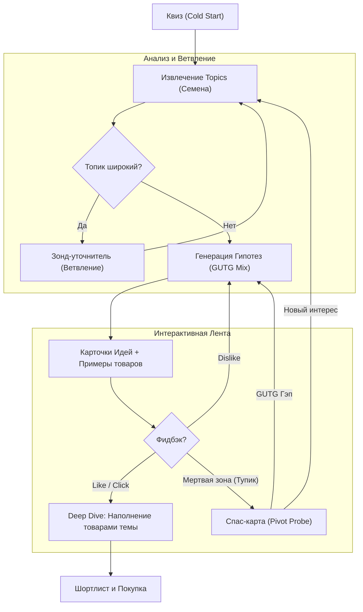

# Алгоритм Исследования и Диалога (Discovery via Dialogue)

> **Философия:** Мы не гадаем, какой подарок нужен пользователю. Мы ведем осознанный диалог, чтобы вместе с ним «достроить» образ идеального подарка, диагностируя жизненные дефициты получателя.

---

## 1. Общая схема процесса

Алгоритм представляет собой цикл обратной связи, где каждое действие пользователя либо сужает текущую тему, либо заставляет систему совершить «прыжок» в новую область.

---

## 2. Этап 1: Анализ Топиков (Branching)

Пользователь часто вводит общие понятия («Игры», «Кухня»). Система должна «коллапсировать» эти понятия до конкретики.

*   **Логика:** LLM анализирует топик. Если он покрывает более 3-х непересекающихся категорий товаров — он считается широким.
*   **Инструмент:** **Зонд-спецификатор**.
*   **Пример:** «Спорт».
    *   *Зонд:* «Это активный спорт (инвентарь), поддержка формы (гаджеты) или фанатство (мерч)?»

---

## 3. Этап 2: Гипотезы и GUTG-гэпы

GUTG используется нами не для классификации человека, а для **покрытия всех возможных «пробоин»** в его жизни в рамках выбранного топика.

Для каждого топика мы генерируем 3–4 гипотезы из разных сфер GUTG:
1.  **Optimizer Idea:** Как этот топик может сделать его жизнь удобнее?
2.  **Catalyst Idea:** Как этот топик может помочь ему вырасти?
3.  **Permission Idea:** Как этот топик может помочь ему расслабиться/позволить себе лишнее?

### Наглядность (The Preview)
Гипотеза никогда не показывается голой. Она всегда содержит **2–3 реальных товара** в качестве примера. Пользователь голосует за «физическое воплощение» идеи.

---

## 4. Этап 3: Детекция Тупика (Dead-End Detection)

Система должна вовремя понять, что она «крутится не там» и раздражает пользователя.

**Критерии Тупика:**
*   **Cold Scroll:** Пролистано > 3 гипотез или > 15 товаров без кликов/лайков.
*   **Decision Paralysis:** Время просмотра карточки в 2 раза выше среднего, но действий нет.
*   **Low Relevancy:** Суммарный вектортный скор выдачи падает (мы начали предлагать «мусор»).

---

## 5. Этап 4: Выход из тупика (The Pivot)

Когда тупик зафиксирован, лента прерывается **Спас-картой**. Мы переключаем внимание пользователя с товаров на исследование смыслов.

### Тип А: Поиск Нового Семени (Topic Pivot)
Если тема «Спорт» не зашла, мы ищем совершенно другой контекст.
*   *Зонд:* «Вижу, со спортом не идет. Давай попробуем иначе: Что он(а) ненавидит делать больше всего?» (Поиск боли вне хобби).

### Тип Б: Поиск Нужды (GUTG Pivot)
Если мы не понимаем *зачем* дарить, мы спрашиваем об эмоциональном дефиците.
*   *Зонд:* «Забудем про вещи. Что ему сейчас нужнее: взбодриться и начать что-то новое или чтобы его просто оставили в покое и дали отдохнуть?»
    *   *Взбодриться* -> Бустим **Catalyst** во всех темах.
    *   *Отдохнуть* -> Бустим **Permission/Optimizer**.

---

## 6. Механика Фидбэка

| Действие пользователя | Сигнал для системы | Техническое следствие |
| :--- | :--- | :--- |
| **Клик на Идею** | «Вектор верный» | Скрываем другие гипотезы, наполняем ленту товарами этой ветки. |
| **Лайк товара** | «Стиль/Специфика верная» | Корректируем визуальный фильтр (центроид эмбеддингов). |
| **Дизлайк концепта** | «Эта дыра не болит» | Понижаем приоритет данной оси GUTG для текущего топика. |
| **Ответ на Зонд** | «Уточнение контекста» | Мгновенная перегенерация поисковых запросов в фоне. |

---

## 7. Финал: Синтез в Шортлист

Когда пользователь находит «своё», он добавляет это в Шортлист. Шортлист — это финальная точка исследования, где система может дать «Обоснование»: 
*«Мы выбрали этот подарок, потому что он закрывает его потребность в [GUTG-гэп], выявленную в процессе нашего диалога».*
