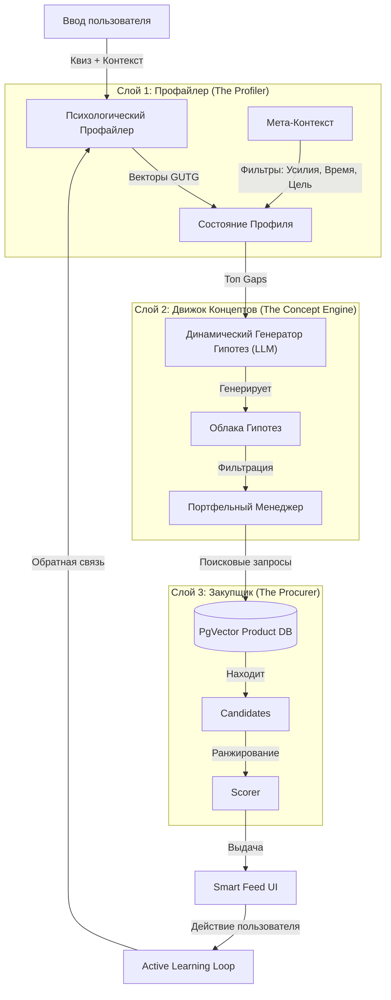

# Gifty Recommendation Engine: The Semantic Bridge (Семантический Мост)

> **Философское ядро:** Мы не рекомендуем товары. Мы рекомендуем *смыслы*, упакованные в товары.

Этот документ описывает архитектуру системы рекомендаций Gifty. В отличие от традиционных систем коллаборативной фильтрации (которые сопоставляют User-to-Item), Gifty использует архитектуру **Семантического Моста** (User -> Psychology -> Concept -> Item).

---

## 1. Высокоуровневая архитектура

Система состоит из трех отдельных слоев, которые преобразуют абстрактное намерение пользователя в конкретные товары, доступные для покупки.



---

## 2. Слой 1: Профайлер (Анализ ввода)

**Цель:** Преобразовать сырой ввод пользователя в **Вероятностный Профиль**.

Профайлер не ищет ключевые слова вроде "гитара". Он ищет *психологические векторы*.

### 2.1. Вектор GUTG
Намерение пользователя мапится на 5 измерений "Grand Unified Theory of Gifting".
*   **Результат:** Распределение вероятностей, например `{Mirror: 0.6, Optimizer: 0.3, Catalyst: 0.1, Anchor: 0.0, Permission: 0.0}`.

### 2.2. Мета-Контекст
Вопросы о *процессе* дарения, а не о получателе. Они действуют как **Жесткие Фильтры** и **Множители Ранжирования**.

| Переменная контекста | Определение | Влияние на архитектуру |
| :--- | :--- | :--- |
| **Relationship (Отношения)** | Кто это? (Партнер, Босс) | **Веса:** "Босс" убивает *Anchor* (слишком интимно), бустит *Optimizer*. |
| **Effort Level (Уровень усилий)** | Своими руками vs "Купить сейчас" | **Фильтрация:** "Низкие усилия" скрывают сложные DIY наборы из *Catalyst*. |
| **Gifting Goal (Цель подарка)** | Впечатлить vs Забота vs Протокол | **Бустинг:** "Впечатлить" бустит *Mirror/Permission*. "Забота" бустит *Optimizer*. |
| **Session Mode (Режим сессии)** | Быстрое решение vs Глубокий поиск | **Процесс:** "Быстро" пропускает глубокие уточнения, показывает надежные варианты (Safe Bets). |
| **Timeline (Сроки)** | Завтра vs Месяц | **Фильтрация:** "Завтра" скрывает товары с долгой доставкой/кастомизацией. |

---

## 3. Слой 2: Движок Концептов (Мозг системы)

**Цель:** Генерировать "Облака Гипотез" — кластеры абстрактных идей, которые служат мостом между психологией и товарами.

### 3.1. Динамическая Генерация Гипотез (DHG)
Мы не поддерживаем статическое дерево категорий. Мы используем LLM или кэшированные кластеры для генерации гипотез на лету.

**Пример потока:**

1.  **Ввод:** Пользователь говорит *"Любит Гитару"*.
2.  **Экспансия DHG:** Движок не просто ищет "гитара". Он расщепляет концепт по осям GUTG:
    *   **Гипотеза A (Catalyst):** "Начинающая рок-звезда" (Нужно: Обучающие материалы, стартовые наборы).
    *   **Гипотеза B (Optimizer):** "Гик звука" (Нужно: Дорогие струны, уход за педалбордом, наборы для чистки).
    *   **Гипотеза C (Mirror):** "Фанат" (Нужно: Биографии, винил, мерч групп).
3.  **Результат:** Теперь у нас есть 3 отличных "Облака" поисковых запросов.

### 3.2. Портфель Гипотез (Стратегия Слоттинга)
Мы никогда не показываем однородную ленту. Мы используем **Портфельную Стратегию** для баланса между Исследованием (Exploration) и Использованием (Exploitation). Лента строится с использованием **Слотов**.

**Алгоритм Слоттинга:**

*   **Слот 1: Надежная ставка (High Confidence).** Прямое попадание из Профайлера. (напр., *Mirror: Фанат Гитары*).
*   **Слот 2: Эмоциональный Пивот.** Другой психологический угол. (напр., *Anchor: "Зафреймить ваше лучшее совместное фото"*).
*   **Слот 3: Практическое решение.** Чистая польза. (напр., *Optimizer: "Апгрейд его утреннего кофе"*).
*   **Слот 4: Джокер (Wildcard).** Случайная догадка с высокой энтропией для проверки нового вектора. (напр., *Permission: "Массажный пистолет"*).

---

## 4. Слой 3: Закупщик (Исполнение)

**Цель:** Найти лучшее физическое доказательство (Товар) для абстрактной Идеи.

1.  **Ввод:** Конкретная *Идея Подарка* (напр., "Набор для ухода за гитарой").
2.  **Поисковые запросы:** `["guitar cleaning kit", "string winder", "fretboard oil"]`.
3.  **Векторный Поиск:** Запрос в пространство эмбеддингов товаров `pgvector`.
4.  **Фильтрация:** Применение Бюджета, Мета-Контекста (Усилия) и Негативных Ключевых слов.
5.  **Выбор:** Выбор "Товара-Героя" + 2 Альтернативы.

---

## 5. Протокол Извлечения (Active Learning)

Это "Метод Сократа" движка. Он превращает систему из поисковика в интервьюера.

### 5.1. Система "Зондов" (Probes)
**Зонд (Probe)** — это вопрос или взаимодействие, предназначенное для коллапса волновой функции намерения пользователя.

**Типы Зондов:**

1.  **Бинарная Развилка (В ленте):**
    *   *Контекст:* У нас есть "Гитара", но мы не знаем уровень навыка.
    *   *Зонд:* "Он новичок, который учится играть, или профи с кучей оборудования?"
    *   *Действие:* [Новичок] -> Буст *Catalyst*. [Профи] -> Буст *Optimizer*.
2.  **Прорыватель Тупика (Dead-End Breaker):**
    *   *Контекст:* Пользователь пролистал 10 товаров без взаимодействия.
    *   *Зонд:* "Давай сменим тему. Что он ненавидит делать? (Уборка, Готовка, Дорога?)"
    *   *Действие:* Инвертировать поиск для решения конкретной боли.
3.  **Проверка Ценностей:**
    *   *Контекст:* Выбор между практичным и веселым предметом.
    *   *Зонд:* "Ты хочешь быть полезным или запоминающимся?"

### 5.2. Петля Обратной Связи (Явное важнее Неявного)
Доверять "времени остановки" (dwell time) слишком рискованно для подарков. Нам нужна **Явная Обратная Связь** для точной калибровки движка.

**Модель Взаимодействия:**
1.  **❤️ Добавить в Шорт-лист (Сильный Позитив):**
    *   *Значение:* "Это направление верное".
    *   *Действие:* Значительно повысить веса этой оси GUTG. Генерировать больше гипотез в этом кластере.
2.  **❌ Дизлайк/Скрыть (Сильный Негатив):**
    *   *Значение:* "Неверный путь".
    *   *Действие:* Забанить эту конкретную гипотезу.
    *   *Уточнение:* **"Протокол 'Почему?'"**. Иногда спрашивать *почему* это было отвергнуто:
        *   *Вариант:* "Слишком дорого" -> Обновить ограничение бюджета.
        *   *Вариант:* "Скучно" -> Переключиться с *Optimizer* на *Catalyst/Mirror*.
        *   *Вариант:* "Не их стиль" -> Инвертировать текущие теги *Aesthetic*.
3.  **🤔 Не уверен (Триггер Зонда):**
    *   *Значение:* "Неоднозначно".
    *   *Действие:* Запустить конкретный **Вопрос-Зонд** (напр., "Это прикольно, но бесполезно?").

**Эффект Шорт-листа:**
По мере того как пользователь собирает шорт-лист, Профиль действует как "Центр Масс" выбранных предметов. Мы используем шорт-лист для переранжирования оставшейся ленты в реальном времени.

---

## 6. Пример Пользовательской Сессии (Поток)

**Шаг 1: Установка (Квиз)**

*   **Пользователь:** "Парень, 30, IT Специалист. Любит Готовить."
*   **Профайлер:** 
    *   База: `Optimizer: 0.3`, `Mirror: 0.3`.
    *   Контекст: `Отношения: Партнер` -> Буст `Anchor`.

**Шаг 2: DHG (Генерация Гипотез)**

*   Система расширяет "Готовка" + "IT":
    *   *H1 (Optimizer/Tech):* "Прецизионная Кулинария" (Су-вид, умные термометры).
    *   *H2 (Permission/Taste):* "Редкие Ингредиенты" (Трюфельное масло, выдержанный бальзамик).
    *   *H3 (Catalyst/Skill):* "Мастерство" (Точильные камни, набор молекулярной кухни).

**Шаг 3: Портфельная Лента (Первые 4 Карточки)**

1.  **Карточка 1 (Optimizer):** "Апгрейд его кухонных гаджетов" (Умный термометр для мяса).
2.  **Карточка 2 (Anchor):** "Свидание с готовкой" (Набор для пасты на двоих).
3.  **Карточка 3 (Permission):** "Униформа Шефа" (Кастомный фартук).
4.  **Карточка 4 (Wildcard):** "Расслабление после работы" (Массажер).

**Шаг 4: Взаимодействие (Зонд)**

*   Пользователь завис на Карточке 1 (Термометр), но не кликает.
*   **Системный Зонд:** "Он любит гаджеты или предпочитает олдскульные ручные инструменты?"
*   **Пользователь:** "Гаджеты."

**Шаг 5: Уточнение**

*   **Обновление Профайлера:** `Optimizer` ++, `Tech` ++. `Old-school` --.
*   **Новая Лента:** Су-вид, Вакууматор, Bluetooth щуп для барбекю. (Идея "Anchor" сдвигается вниз).

---

## 7. Модели Данных

### Гипотеза (The Hypothesis)
Промежуточная структура данных между Намерением Пользователя и Товаром.

```json
{
  "id": "cooking_precision_tech",
  "title": "Precision Cooking Lab",
  "gutg_axis": "Optimizer",
  "gutg_subtype": "Upgrade",
  "reasoning": "Он в IT, поэтому, скорее всего, ценит точность и контроль.",
  "search_queries": ["sous vide", "smart thermometer", "precision scale"],
  "validation_question": "Does he treat cooking as an art or a science?"
}
```

### Состояние Пользователя (The User State)
```json
{
  "session_id": "xyz",
  "gutg_weights": {
    "mirror": 0.2,
    "optimizer": 0.6,
    "permission": 0.2
  },
  "meta_context": {
    "effort": "low",
    "goal": "impress"
  },
  "active_hypotheses": ["cooking_precision_tech", "smart_home"],
  "rejected_hypotheses": ["cooking_aprons"]
}
```
