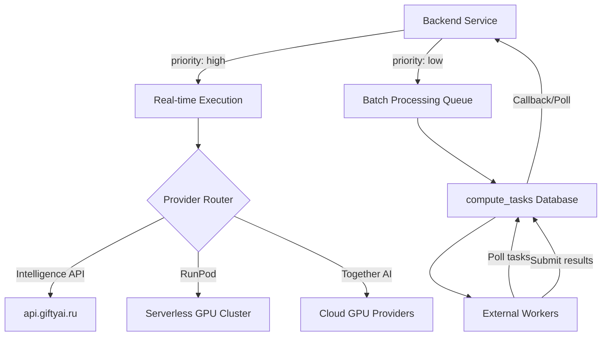

# Hybrid Intelligence Architecture

Этот документ описывает архитектуру распределенных вычислений Gifty для задач машинного обучения (embeddings, reranking, classification).

## Обзор

Gifty использует гибридный подход к обработке ML-задач, разделяя их по приоритету и стоимости выполнения. Система автоматически маршрутизирует задачи между внешними API, GPU-фермами (RunPod) и локальными воркерами.



---

## 1. Режимы выполнения

### Online (Real-time)
*   **Используется для:** ответов пользователю в чате, быстрого поиска, превью рекомендаций.
*   **Приоритет:** `high`.
*   **Скорость:** < 1-2 сек.
*   **Провайдеры:** RunPod (основной), Intelligence API (fallback), Together AI.

### Offline (Batch/Queue)
*   **Используется для:** фонового парсинга товаров, пересчета эмбеддингов всего каталога, тяжелого скоринга.
*   **Приоритет:** `low`.
*   **Механизм:** Задачи сохраняются в таблицу `compute_tasks`.
*   **Воркеры:** Скрипты на Kaggle, домашние GPU-кластеры или свободные ресурсы.

---

## 2. Маршрутизация (Provider Routing)

Система управления ML-задачами (`IntelligenceAPIClient`) настраивается через [`configs/logic.yaml`](../engineering/configuration.md).

### Эмбеддинги (Embeddings)
Поддерживаемые провайдеры:
1.  `intelligence_api`: Стандартный API Gifty.
2.  `runpod`: Оптимально для высокой нагрузки.
3.  `together`: Широкий выбор open-source моделей.

### LLM (AI Reasoning)
Поддерживаемые провайдеры:
- Anthropic (Claude)
- Google (Gemini)
- Groq (Llama 3 / Mixtral)
- OpenRouter (Агрегатор)
- Together AI

---

## 3. Таблица задач (Task Queue)

Для обработки `low-priority` задач воркеры используют внутренний API:

1.  **Получение задач:** `GET /internal/workers/tasks` — выдает пачку задач и помечает их как `processing`.
2.  **Отправка результата:** `POST /internal/workers/tasks/{id}/result` — сохраняет результат и помечает задачу как `completed`.

---

## 4. Конфигурация

Все настройки моделей и провайдеров вынесены в YAML-конфиг для возможности горячей замены без изменения кода.

Пример настройки в `configs/logic.yaml`:
```yaml
llm:
  default_provider: "anthropic"
  embedding_provider: "runpod"
  model_embedding: "bge-m3"
```
